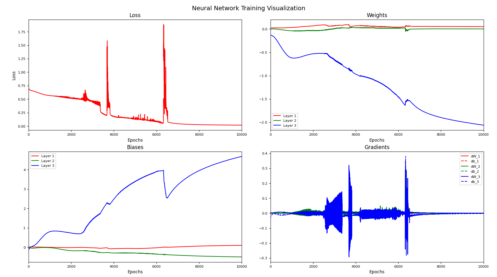
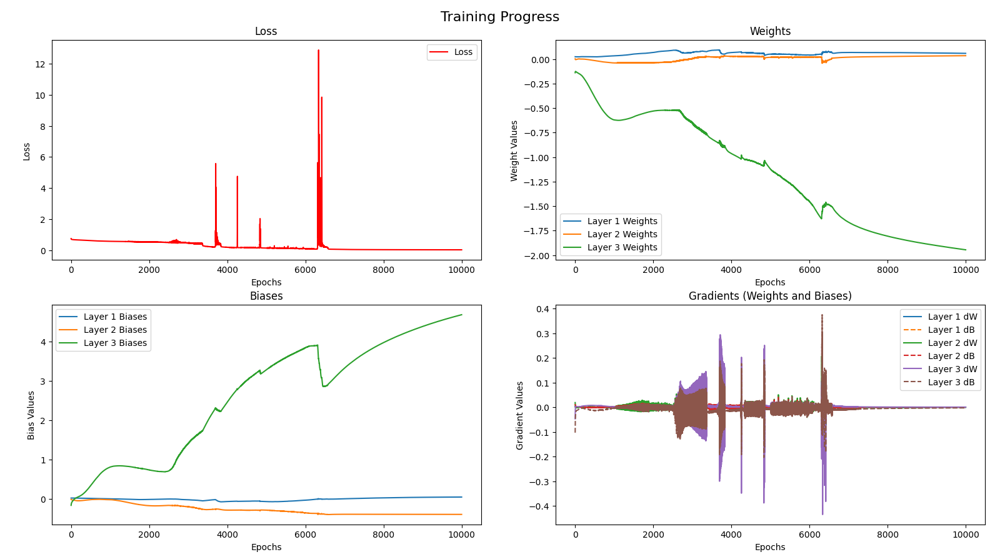
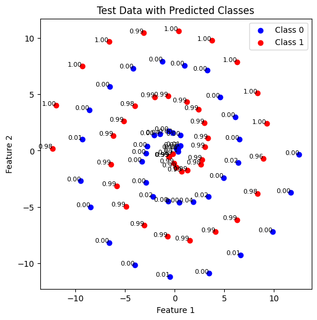

# The Problem
This is a binary classification problem where data points are generated parametrically using the dedicated `SpiralData` class from `spiral_datapoint.py`. The data points are classified into two categories: blue (0) and red (1). The problem is addressed using a basic neural network structure.

## Neural Network Architecture
The neural network consists of an input layer, two hidden layers, and an output layer, with neuron sizes of 1x18x4x1. ReLU is used as the activation function in the hidden layers, while a sigmoid function is applied at the output layer. The architecture is largely influenced by the problem and its parameters. As this is a simple neural network intended for learning purposes, no fine-tuning, learning rate optimization, or regularization techniques have been applied.

## Scripts
I developed several scripts for this project:
- `nn.py`: This script implements the neural network using only NumPy to better understand its internal mechanics.
- `nn_torch.py`: Here, I used the Torch framework to implement the same neural network.
- `spiral_datapoint.py`: This script initializes the data points for training and testing.
- `tester.py`: Contains test classes for evaluating the models trained and saved using both `nn.py` and `nn_torch.py`.
- `train.py` and `train_and_test.ipynb`: These scripts implement the training process for both versions of the neural network.
- `training_comparison_exp.py`: An experimental script designed to explore the differences between the custom (NumPy-based) and Torch-based implementations of the training scripts.

## Experiences & Difficulties I Encountered
I began by developing a NumPy-based neural network, implementing the components for training step by step, based on my research and literature review. Since most resources recommend using ReLU for hidden layers and sigmoid for output layers, I applied these activations. Additionally, I experimented with using sigmoid in the hidden layers and softmax at the output. I also tested leaky ReLU when I suspected a vanishing gradient issue, as gradients were diminishing too quickly.

I determined the size of neurons and layers through experimentation. I used [TensorFlow Playground](https://playground.tensorflow.org/) to help decide these parameters, particularly focusing on how different neuron structures could approximate various levels of functional complexity. This process helped me refine my development.

Initially, my custom neural network did not work as expected. It consistently got stuck with a binary cross-entropy loss around 0.6-0.7 when using learning rates between 0.01 and 0.1. For learning rates above 0.1, the loss did not decrease at all. Gradients were diminishing too rapidly, causing the system to stop learning. Instead of blue data points converging to 0 and red to 1, all predictions were centered around 0.5. I was convinced that this was due to a vanishing gradient issue and researched extensively to resolve it.

To further investigate, I implemented the same algorithm using PyTorch to see if the problem persisted. Surprisingly, the PyTorch version worked on the first attempt, suggesting that the issue was not related to vanishing gradients, as the same logic worked in PyTorch. This indicated that there was a mistake in my custom implementation.

I then created a comparison experiment script to run both the custom and PyTorch implementations for one epoch to identify the differences in results. I thoroughly examined PyTorch's weight and bias initialization, forward and backward propagation, and parameter updates. By printing and analyzing the results, I discovered that while there was no difference with a single sample, as the sample size increased, the bias differences grew proportionally to the number of samples. Upon reviewing the backpropagation algorithm, I realized that I had forgotten to divide the bias gradients by the sample size. After correcting this, the custom neural network started functioning correctly.

Due to the lack of batch normalization and learning rate optimization, the training process remains highly dependent on initialization. As a result, the outcome varies depending on the random seed used. In future problems, I plan to implement these features based on the insights and experiences gained from this work.

## Results
I added a PyTorch neural network class to the custom neural network script to initialize weights and biases similarly in order to ensure consistent results across both implementations by using the same random seeds.

We used spiral data with the following parameters: `num_points=40`, `noise=0.2`, and `revolutions=4`. In total, we generated 500 points (250 red, 250 blue) for each training phase.

We plotted several results:
1. Binary Cross-Entropy (CE) Loss
2. Weights
3. Biases
4. Gradients

To represent weights, biases, and gradients in a 2D plot with a single scalar value, we applied the operation: `weight.data.mean().item()`. This operation computes the mean of the weight and bias values and retrieves the result as a scalar to simplify visualization.

### Custom Neural Network Results
In the custom neural network, we achieved a loss of **0.0195** after 10,000 epochs.

During testing, we achieved an accuracy of **98.75%** on 40 test data points.

### PyTorch Neural Network Results
In the PyTorch neural network, we achieved a loss of **0.0185** after 10,000 epochs.

During testing, we also achieved an accuracy of **98.75%** on 40 test data points.

