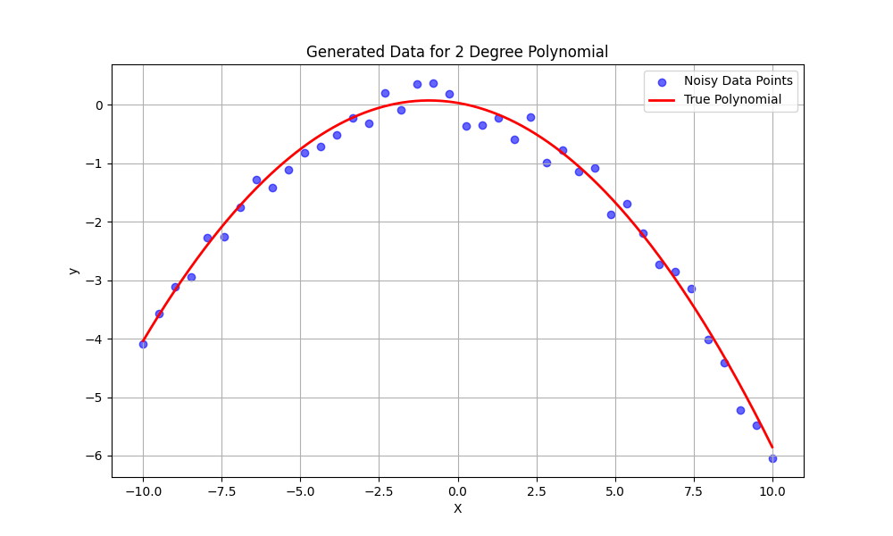
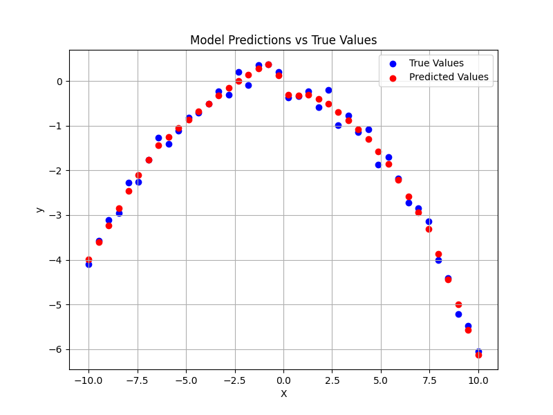
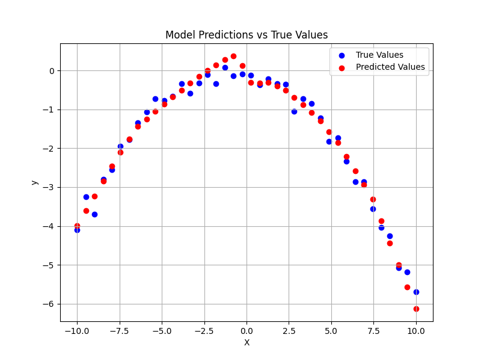

# The Problem
This is a regression problem where training and testing data points are generated using a dedicated script for polynomial data generation. The goal was to create a neural network structure that is prone to overfitting, allowing me to observe and address overfitting issues to improve the model's generalization using regularization techniques.

## Neural Network Architecture
The neural network consists of an input layer, two hidden layers, and an output layer, with neuron sizes of 1x88x48x1. ReLU is used as the activation function in the hidden layers, while a linear function is applied at the output layer. I made hidden layer sizes large so that it could overfit faster.

## Scripts
- `nn.py`: Implements the neural network using only NumPy, providing a deeper understanding of its internal mechanics.
- `nn_torch.py`: Implements the same neural network using the PyTorch framework for easier deployment and comparison.
- `hyperparams.py`: Initializes and stores hyperparameters for consistent use across both training and testing scripts.
- `polynomial_data.py`: Generates polynomial data points in a parametrized way for training and testing.
- `test.py`: Contains a model testing class to evaluate both the NumPy-based (`nn.py`) and PyTorch-based (`nn_torch.py`) networks.
- `training.py`: Implements the training process for both `nn.py` and `nn_torch.py` models.

## Experiences & Difficulties I Encountered
I started by developing a NumPy-based neural network, similar to the approach I used in the previous problem, implementing the training components step by step. For this regression problem, I used ReLU for the hidden layers and a linear activation function for the output layer, which is standard for regression tasks.

I was able to parameterize the polynomial data points, allowing me to experiment with different neural network architectures and data point ranges to facilitate learning and promote overfitting. Since no normalization was applied to the data, I tried to select x and y values that were naturally close to a normal distribution. When I scaled the data too far from ideal values (by increasing or decreasing the scale factor, which I had implemented in the scripts), the gradient descent algorithm struggled to reduce the loss and fit the polynomial. **I plan** to address this issue by applying normalization in future iterations.

Initially, I considered using a 5th-degree polynomial for the problem, but this proved too challenging with the current network architecture. As my primary focus was on overfitting, I opted for a 2nd-degree polynomial to make the problem easier to solve. **I also plan** to explore how to modify the neural network to approximate higher-degree polynomials, such as 5th degree or beyond.

Below is a graph showing my training dataset.

## Overfitting
Overfitting occurs when a model learns the training dataset too well, achieving a very low training loss. However, because the model cannot generalize the learned patterns, it struggles on unseen data, leading to a higher test loss. In such cases, the model effectively memorizes the training data rather than learning a flexible solution that generalizes to new inputs.

I trained the model for 50,000 epochs, achieving a final training loss of **0.0206**. When tested on data with the **same noise seed** as the training set, the model produces the same mean squared error (MSE) loss of **0.0206**, successfully approximating the polynomial function and noise pattern.

However, when tested with a **different noise seed**, the model reveals its inability to generalize. The model still tries to approximate values specific to the training noise seed, and this issue persists across different noise variations. Instead of generalizing the training data, the model memorized it. As shown in the plot below, the red curves are nearly identical to those in the previous plot, indicating that the model is overfitted. The loss with the new noise seed is **0.0570**, nearly three times the training loss, highlighting how the model is highly specialized to the original seed rather than being adaptable.

