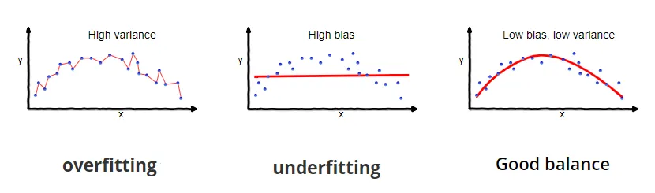
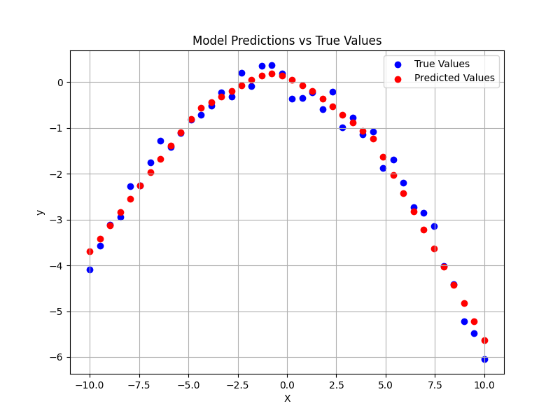
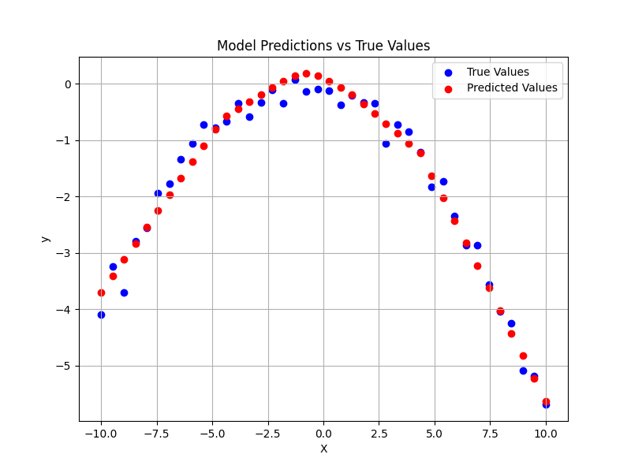
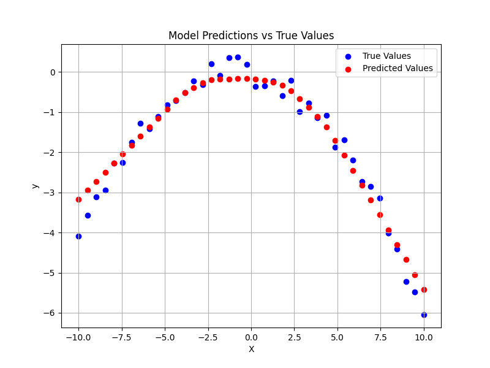
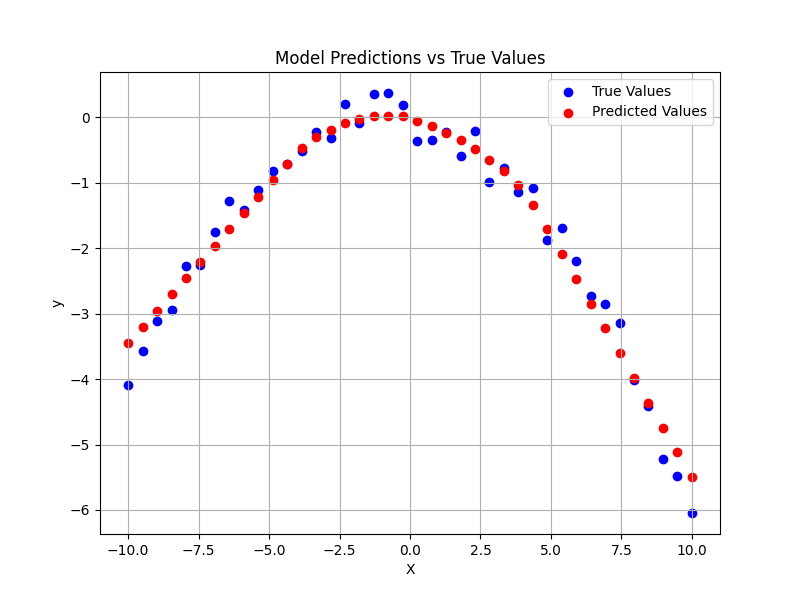

# The Problem
This is a regression problem where training and testing data points are generated using a dedicated script for polynomial data generation. The goal was to create a neural network structure that is prone to overfitting, allowing me to observe and address overfitting issues to improve the model's generalization using regularization techniques.

## Neural Network Architecture
The neural network consists of an input layer, two hidden layers, and an output layer, with neuron sizes of 1x88x48x1. ReLU is used as the activation function in the hidden layers, while a linear function is applied at the output layer. I made hidden layer sizes large so that it could overfit faster.

## Scripts
- `nn.py`: Implements the neural network using only NumPy, providing a deeper understanding of its internal mechanics.
- `nn_torch.py`: Implements the same neural network using the PyTorch framework for easier deployment and comparison.
- `hyperparams.py`: Initializes and stores hyperparameters for consistent use across both training and testing scripts.
- `polynomial_data.py`: Generates polynomial data points in a parametrized way for training and testing.
- `test.py`: Contains a model testing class to evaluate both the NumPy-based (`nn.py`) and PyTorch-based (`nn_torch.py`) networks.
- `training.py`: Implements the training process for both `nn.py` and `nn_torch.py` models.

## Experiences & Difficulties I Encountered
I started by developing a NumPy-based neural network, similar to the approach I used in the previous problem, implementing the training components step by step. For this regression problem, I used ReLU for the hidden layers and a linear activation function for the output layer, which is standard for regression tasks.

I was able to parameterize the polynomial data points, allowing me to experiment with different neural network architectures and data point ranges to facilitate learning and promote overfitting. Since no normalization was applied to the data, I tried to select x and y values that were naturally close to a normal distribution. When I scaled the data too far from ideal values (by increasing or decreasing the scale factor, which I had implemented in the scripts), the gradient descent algorithm struggled to reduce the loss and fit the polynomial. **I plan** to address this issue by applying normalization in future iterations.

Initially, I considered using a 5th-degree polynomial for the problem, but this proved too challenging with the current network architecture. As my primary focus was on overfitting, I opted for a 2nd-degree polynomial to make the problem easier to solve. **I also plan** to explore how to modify the neural network to approximate higher-degree polynomials, such as 5th degree or beyond.

Below is a graph showing my training dataset.


## Overfitting
Overfitting occurs when a model learns the training dataset too well, achieving a very low training loss. However, because the model cannot generalize the learned patterns, it struggles on unseen data, leading to a higher test loss. In such cases, the model effectively memorizes the training data rather than learning a flexible solution that generalizes to new inputs.

I trained the model for 50,000 epochs, achieving a final training loss of **0.0206**. When tested on data with the **same noise seed** as the training set, the model produces the same mean squared error (MSE) loss of **0.0206**, successfully approximating the polynomial function and noise pattern.


However, when tested with a **different noise seed**, the model reveals its inability to generalize. The model still tries to approximate values specific to the training noise seed, and this issue persists across different noise variations. Instead of generalizing the training data, the model memorized it. As shown in the plot below, the red curves are nearly identical to those in the previous plot, indicating that the model is overfitted. The loss with the new noise seed is **0.0570**, nearly three times the training loss, highlighting how the model is highly specialized to the original seed rather than being adaptable.


## Bias, Variance, Underfitting, and Overfitting
- **Bias** refers to the assumptions made by the model about the relationship between input and output. High bias means the model is overly simplistic and may not capture the complexity of the data, leading to underfitting.
- **Variance** measures the sensitivity of the model to variations in the training data. High variance usually occurs with complex models that closely fit the training data, but struggle to generalize to new data, leading to overfitting.

There is a tradeoff between bias and variance:
- **High bias** results in the model making too many assumptions, which can cause it to underfit on unseen data, meaning it won't capture the underlying patterns in the data.
- **High variance** causes the model to be too sensitive to the training data, memorizing it rather than learning general patterns. This can lead to overfitting, where the model performs well on training data but poorly on test data.

The figure below, taken from [Towards Data Science](https://towardsdatascience.com/understanding-the-bias-variance-tradeoff-165e6942b229), illustrates the bias-variance tradeoff clearly.



Additionally, this [YouTube video](https://www.youtube.com/watch?v=a6YH6EbM9xA&list=LL&index=5) provides a great summary of bias and variance.

### Ways to Prevent Underfitting:
- Train the model for more epochs.
- Increase the complexity of the model (e.g., more neurons or layers).
- Improve the network architecture to better suit the problem.

### Ways to Prevent Overfitting:
- Train with more data.
- Apply regularization techniques, such as L1 or L2 regularization.
- Use dropout or early stopping during training.
- Improve the network architecture to better balance complexity and generalization.


## Regularization
To address overfitting and improve generalization within the same number of training epochs, I implemented L2 regularization in both the NumPy-based and PyTorch-based neural networks.

**Regularization** is a technique designed to prevent the model's weights from growing too large by adding a penalty term to the loss function. This discourages the network from relying too heavily on any single input, ensuring that the model generalizes better to unseen data. When weights become too large, the loss increases, and during backpropagation, the model is penalized (in a way similar to negative reinforcement in reinforcement learning). As a result, the model tends to balance its focus across inputs rather than overfitting to specific patterns.

- **L1 Regularization**: Adds a penalty proportional to the absolute value of the weights, driving them towards zero.
- **L2 Regularization**: Adds a penalty proportional to the square of the weights, penalizing larger weights more heavily, which helps smooth out the model's predictions.

### L2 Regularization in NumPy Implementation
In the NumPy-based network, I implemented L2 regularization by calculating the sum of the squared weights and adding it to the total loss function. Here's how I computed the L2 penalty:

```python
weights_sum = np.sum(np.square(self.W1)) + np.sum(np.square(self.W2)) + np.sum(np.square(self.W3))
# Compute L2 regularization term
l2_loss = self.l2_lambda / (2 * m) * weights_sum
loss += l2_loss
```

Where:
- `self.W1`, `self.W2`, and `self.W3` are the weights of the layers.
- `m` is the number of samples in the batch.
- `self.l2_lambda` is the regularization strength.

I also incorporated the L2 term during backpropagation, adjusting the weight gradients accordingly:

```python
self.dw3 = np.matmul(self.a2.T, dz3) / m + self.l2_lambda / m * self.W3
```

This ensures that the gradient updates account for the regularization term, keeping the weights from becoming too large.

### Results with L2 Regularization
After testing, I observed that the model learned the pattern in a more generalized way, reducing overfitting and improving performance on unseen data. The figures below illustrate the results of testing with the **same noise seed** and with a **different noise seed** after applying L2 regularization:

- **Same Noise Seed:**



- **Different Noise Seed:**




### Dropout
After implementing L2 regularization, I also decided to apply the dropout technique for further improvement in generalization.

Dropout works by deactivating a random subset of neurons during each forward and backward propagation step in training. Each neuron has a probability of being "dropped," meaning it won't participate in that particular pass. This technique prevents the model from becoming overly reliant on any specific neurons, promoting more robust learning and better generalization. In essence, it serves as another form of regularization by randomly setting some weights to zero, forcing the model to distribute learning across multiple features.

In the NumPy-based neural network, I implemented a mask to deactivate neurons with a certain probability. This approach zeroes out the activations of randomly selected neurons, preventing them from transmitting any information to subsequent layers. Here's an example of how I implemented it:

```python
if training:
    # Apply dropout to a1
    self.dropout_mask1 = (np.random.rand(*self.a1.shape) > self.dropout_p1) / (1.0 - self.dropout_p1)
    self.a1 *= self.dropout_mask1
```

This code ensures that, during training, a fraction of the neurons in layer one are deactivated based on the dropout probability `dropout_p1`. In the backward pass, the same mask is applied to ensure consistency:

```python
# Apply dropout mask to dz2
dz2 *= self.dropout_mask2
```

### Results with L2 Regularization & Dropout
As expected, combining L2 regularization with dropout yielded better results. The model was able to generalize more effectively, approximating the function with improved flexibility.

Below are the plots demonstrating the results with L2 regularization and dropout applied:

- **Same Noise Seed:**



- **Different Noise Seed:**




