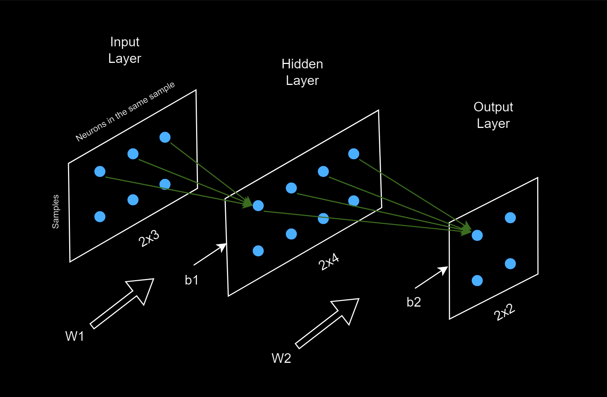

# Forward Propagation Explained

In this section, we will break down the math behind the forward propagation algorithm, which is the core of neural network training. Forward propagation is performed in every iteration during training and also in the testing phase.

## Neural Network Structure in Training

In any neural network, there is always an input layer and an output layer, with a variable number of hidden layers, which can range from 0 to infinity. To simplify the explanation and help visualize the concept, we will use a small neural network with the following structure: 3 neurons in the input layer, 4 neurons in a single hidden layer, 2 neurons in the output layer, 2 samples in a batch. This setup will allow me to illustrate how forward propagation works in a straightforward way, without losing key insights.

### Batches & Samples

A batch is a training unit that consists of a set of samples processed together in one iteration during the training of a model. Samples in a batch share the same weight and bias tensors (tensors are a type of multi-dimensional array) and contribute to adjusting these parameters together during training.

### Weights and Biases

They are parameters to be adjusted during training to give the best results out of approximated function. Except for input layer (actually units in input layers are not actually neurons), every neuron in every layer is connected each neuron in previous layer with a weight specicific to this connection. value of neuron is obtained via multiplying all these weights with activations of previous layer neurons and adding bias at the end. bias is the tensor specific to each layer. 

### Activations

In every layer after input layer, an element-wise activation function is applied to the neurons, giving the system its nonlinear properties. The choice of activation function depends on the specific problem, and there are many options available, such as ReLU, Sigmoid, Tanh, etc.

### Layer Calculations

Below is an illustration of a neural network during the training phase. 

- **Blue dots** represent neurons. Neurons on the same horizontal axis belong to the same sample, while neurons on the vertical axis represent different samples.
- **Green arrows** depict the connections between neurons, which carry weights (for simplicity, only connections to two target neurons are illustrated).
- **W1 and W2** are the weight tensors between layers.
- **b1 and b2** are the bias tensors added to each layer's activations.




You can think of these layers as matrix representations in this example. If you look at the front view, the input layer is a 2x3, the hidden layer is a 2x4, and the output layer is a 2x2 matrix. Each connection has a weight value, and the value of a single neuron is calculated as follows. For example, the first neuron in the hidden layer is computed as:

For the first sample:
$$ z_{11} = x_{11} \cdot w_{11} + x_{12} \cdot w_{21} + x_{13} \cdot w_{31} + b_{11} $$

Similarly, for the second neuron in the hidden layer:
$$ z_{12} = x_{11} \cdot w_{12} + x_{12} \cdot w_{22} + x_{13} \cdot w_{32} + b_{12} $$

We continue with the rest of the neurons in the hidden layer:
$$ z_{13} = x_{11} \cdot w_{13} + x_{12} \cdot w_{23} + x_{13} \cdot w_{33} + b_{13} $$

$$ z_{14} = x_{11} \cdot w_{14} + x_{12} \cdot w_{24} + x_{13} \cdot w_{34} + b_{14} $$

For the second sample, the process is similar:
$$ z_{21} = x_{21} \cdot w_{11} + x_{22} \cdot w_{21} + x_{23} \cdot w_{31} + b_{11} $$

$$ z_{22} = x_{21} \cdot w_{12} + x_{22} \cdot w_{22} + x_{23} \cdot w_{32} + b_{12} $$

$$ z_{23} = x_{21} \cdot w_{13} + x_{22} \cdot w_{23} + x_{23} \cdot w_{33} + b_{13} $$

$$ z_{24} = x_{21} \cdot w_{14} + x_{22} \cdot w_{24} + x_{23} \cdot w_{34} + b_{14} $$

### Matrix Representation

We can represent these equations in matrix form as:

**Input matrix (X)** of size $2 \times 3$:
$$ X = \begin{bmatrix} x_{11} & x_{12} & x_{13} \\ x_{21} & x_{22} & x_{23} \end{bmatrix} $$

**Weight matrix ($W_1$)** of size $3 \times 4$:
$$ W_1 = \begin{bmatrix} w_{11} & w_{12} & w_{13} & w_{14} \\ w_{21} & w_{22} & w_{23} & w_{24} \\ w_{31} & w_{32} & w_{33} & w_{34} \end{bmatrix} $$

**Bias vector ($b_1$)** of size $1 \times 4$:
$$ b_1 = \begin{bmatrix} b_{11} & b_{12} & b_{13} & b_{14} \end{bmatrix} $$

**Output ($Z_1$)** is the resulting matrix after applying forward propagation to the hidden layer:
$$ Z_1 = \begin{bmatrix} z_{11} & z_{12} & z_{13} & z_{14} \\ z_{21} & z_{22} & z_{23} & z_{24} \end{bmatrix} $$

### Matrix Multiplication for Forward Propagation

Using matrix multiplication and adding the bias term, we can express the output $Z_1$ as:
$$ Z_1 = X \cdot W_1 + b_1 $$

**Note:** In this operation, when we add the bias vector $b_1$ of size $1 \times 4$ to the resulting matrix $Z_1$ from $X \cdot W_1$ of size $2 \times 4$, broadcasting is utilized. Broadcasting allows $b_1$ to be effectively expanded to match the dimensions of $Z_1$, so that each element of $b_1$ is added to every row of the matrix $Z_1$. This enables the operation to be valid even though the two matrices originally have different dimensions.

### Key Insights

- The same set of weights $W_1$ and biases $b_1$ are used for both samples in the batch.
- The forward propagation algorithm applies the weights and biases individually to each sample, meaning that each neuron in the hidden layer is calculated using only the corresponding neurons from the input layer.
- No information is shared between samples during forward propagation. Each sample generates its own hidden layer activations based on the entire weight matrix $W_1$, but without cross-sample interaction.

### Numerical Example using NumPy

Let's implement the previous example using NumPy to see concrete results. This structure could represent a basic classification problem, such as classifying points in a 3D space (with 3 input feature coordinates) into two categories: red or blue. The output will be two neurons representing these two categories, with softmax activation applied to the output layer. Softmax is commonly used in binary classification problems because it outputs probabilities that represent the likelihood of belonging to each class (either blue or red).

#### Architecture Overview:

- **Input Layer:** 3 input features (e.g., 3D coordinates)
- **Hidden Layer:** 1 hidden layer with 4 neurons and ReLU activation
- **Output Layer:** 2 neurons in the output layer, with softmax activation for classification

It’s important to note that this example is solely for demonstration purposes to understand the logic behind forward propagation and is not intended for actual training. With only 2 samples, proper training is not feasible. However, this setup will allow us to observe the forward pass of data through the network.

#### Network Architecture Definition:

```python
# Define network architecture
input_size = 3
hidden_size = 4
output_size = 2  # Number of classes, either blue or red
```


