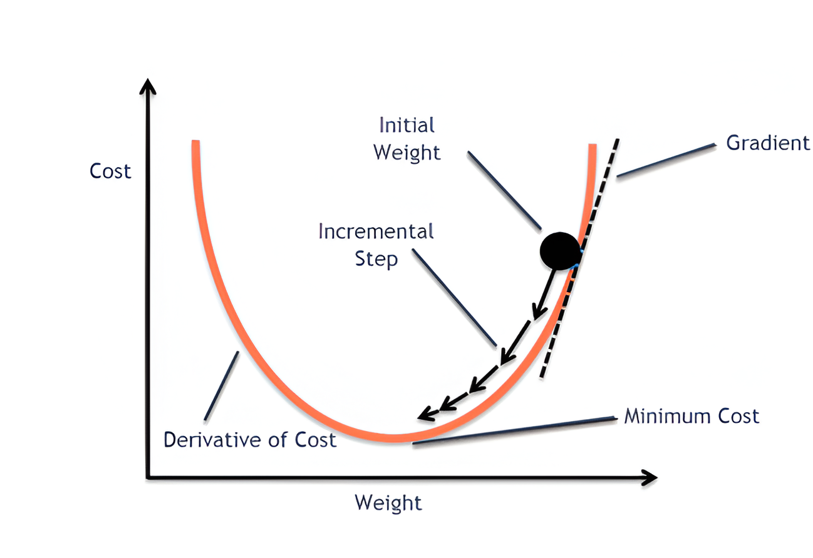

# Backward Propagation and Gradient Descent Explained

In this section, we will break down the math behind the backward propagation process and the gradient descent algorithm. These two concepts form the backbone of neural network training and are foundational across all types of deep learning training. Backward propagation implements the gradient descent algorithm, executed in every iteration after forward propagation during training to progressively adjust model parameters and bring the output predictions closer to the correct labels.

## Logic & Calculations
We will perform calculations and explanations using the exact same neural network structure from the [Forward Propagation Explained](01_forward_propagation.md) section. Therefore, the network architecture and parameters will not be reintroduced here.

**Backpropagation** is a fundamental algorithm used to train neural networks by adjusting all the learnable parameters (such as weights and biases) in every layer. After obtaining predictions through **forward propagation**, backpropagation calculates how each parameter contributes to the loss, allowing the network to update these parameters to minimize the loss function.

To understand how a parameter affects the loss, backpropagation computes the **gradients**—the derivatives of the loss with respect to each parameter—using the **chain rule** from calculus. These gradients indicate the direction and magnitude by which each parameter should be adjusted to reduce the loss.

Once the gradients are computed, an **optimization algorithm** like **Gradient Descent** is employed to update the parameters. **Gradient Descent** is an optimization technique that iteratively adjusts the parameters in the opposite direction of the gradients to find a local minimum of the loss function.

In summary, backpropagation consists of two main steps in a simple neural network:
1. **Calculating Gradients:** Using the chain rule, backpropagation efficiently computes the gradients of the loss with respect to each parameter.
2. **Updating Parameters:** An optimization algorithm (e.g., Gradient Descent) uses these gradients to adjust the parameters in a way that minimizes the loss.


### Gradient Descent Details

The graph below, taken from [here](https://vitalflux.com/gradient-descent-explained-simply-with-examples/), illustrates how gradient descent works to minimize the cost (loss) function.



Consider a weight $w$. The formula that expresses how it updates the parameter is:

$$
w_{\text{new}} = w_{\text{old}} - \alpha \left.\frac{\partial L}{\partial w}\right|_{w=w_{\text{old}}}
$$

where:

- **$w_{\text{old}}$**  
  The current value of the weight before the update. It's the starting point for the gradient descent step.

- **$w_{\text{new}}$**  
  The updated value of the weight after applying the gradient descent step.

- **$L$**  
  The cost (loss) function that measures the discrepancy between the predicted values and the actual values.

- **$\frac{\partial L}{\partial w}\bigg|_{w=w_{\text{old}}}$**  
  The derivative of the cost function with respect to the weight $w$, evaluated at $w = w_{\text{old}}$. This derivative represents the **gradient**, slope of that function at the current weight value, indicating the direction and rate at which $L$ changes with respect to $w$.

- **$\alpha$**  
  The learning rate, a hyperparameter that determines the size of the steps taken towards the minimum of the loss function. It controls the update strength, as depicted by the incremental step in the graph. A larger $\alpha$ means bigger steps towards the minimum, which can speed up convergence but risks overshooting. A smaller $\alpha$ ensures more precise updates but may slow down the training process.

By iteratively applying this update rule, gradient descent navigates the parameter space to find the weight values that minimize the loss function.

#### Visual Interpretation

In the gradient descent graph:

- The **orange curve** represents the cost function $L(w)$ as a function of the weight $w$.

- The **gradient** at $w_{\text{old}}$ is the slope of the tangent to the curve at that point.

- The **learning rate** $\alpha$ determines the length of the step taken along the gradient to reach $w_{\text{new}}$.


### Gradient Calculation Example

To apply gradient descent, we first need to compute gradients. To find the gradient of every weight and bias in our system, we utilize the chain rule from calculus. This allows us to decompose the gradient of a parameter into the product of multiple partial derivatives of intermediate variables, which can be computed directly.

For example, suppose we want to find the gradient of $W_2$ from the [previous neural network](01_forward_propagation.md), that is **$\frac{\partial L}{\partial W_2}$**. Let's walk through the steps to derive **$\frac{\partial L}{\partial W_2}$** analytically.

In the neural network, $W_2$ connects the activations of the hidden layer to the output layer. Let:

- **$a_1$** be the activations of the hidden layer.
- **$z_2$** be the pre-activation output of the second layer.
- **$y$** be the true labels, and **$y_{\text{pred}}$** be the predicted output.

The **loss function** $L$ (cross-entropy in our example but also can be mean square) depends on $y_{\text{pred}}$, which in turn depends on $W_2$. The gradient **$\frac{\partial L}{\partial W_2}$** tells us how much the loss changes with respect to $W_2$. To compute this, we use the chain rule.

#### Full Equation of Chain Rule:

The chain rule in calculus states that when you want to compute the derivative of a function with respect to a variable that is not directly dependent, you can break it down into a series of intermediate steps. In this case, we want to compute **$\frac{\partial L}{\partial W_2}$** where **L** is the loss function and **$W_2$** is a weight matrix in the neural network.

To do this, we apply the chain rule step by step, from the end to **$W_2$**:

$$
\frac{\partial L}{\partial W_2} = \frac{\partial L}{\partial a_2} \cdot \frac{\partial a_2}{\partial z_2} \cdot \frac{\partial z_2}{\partial W_2}
$$

This equation means that to compute the gradient of **$L$** with respect to **$W_2$**, we need three components:
1. **$\frac{\partial L}{\partial a_2}$** – how the loss changes with respect to the softmax output **$a_2$**.
2. **$\frac{\partial a_2}{\partial z_2}$** – how the softmax output changes with respect to the pre-activation **$z_2$**.
3. **$\frac{\partial z_2}{\partial W_2}$** – how the pre-activation **$z_2$** changes with respect to the weight **$W_2$**.


#### Definitions

Before diving into the derivation, let's clearly define the components involved:

1. **Softmax Activation**:
   
   For the output layer, the softmax function converts raw values of output neurons ($Z_2$) into probabilities ($Y_{\text{pred}}$). For a single sample $k$ and output class $i$:
   
   $$
   Y_{\text{pred}}^{(k,i)} = \frac{e^{Z_2^{(k,i)}}}{\sum_{j=1}^{C} e^{Z_2^{(k,j)}}}
   $$
   
   Where:
   - $C$ is the number of output classes.
   - $Z_2^{(k,i)}$ is the pre-activation (logit) for class $i$ in sample $k$.
   - $Y_{\text{pred}}^{(k,i)}$ is the predicted probability for class $i$ in sample $k$.

2. **Cross-Entropy Loss**:
   
   The cross-entropy loss measures the discrepancy between the true distribution ($Y$) and the predicted distribution ($Y_{\text{pred}}$). For a single sample $k$:
   
   $$
   \text{Loss}^{(k)} = -\sum_{i=1}^{C} Y^{(k,i)} \log(Y_{\text{pred}}^{(k,i)})
   $$
   
   Where:
   - $Y^{(k,i)}$ is the true label (typically one-hot encoded) for class $i$ in sample $k$.
   - $Y_{\text{pred}}^{(k,i)}$ is as defined above.

    The total loss for all samples can be written as:

    $$
    \text{Total Loss} = \sum_{k=1}^{m} \text{Loss}^{(k)}
    $$

    where $m$ is the total number of samples.

    Substituting the expression for $\text{Loss}^{(k)}$:

    $$
    \text{Total Loss} = - \sum_{k=1}^{m} \sum_{i=1}^{C} Y^{(k,i)} \log(Y_{\text{pred}}^{(k,i)})
    $$

    This is the total categorical cross-entropy loss averaged over $m$ samples.


    We use the **averaged loss** to help with error scaling and to prevent issues such as unstable or exploding gradients during training. In the actual calculations, we first compute the **total loss** by summing over all samples in the batch. Then, we divide this total by the sample size to normalize it, ensuring that the loss is on a manageable scale regardless of the batch size.

    The formula for the averaged loss is:

    $$
        \text{Averaged Loss} = - \frac{1}{m} \sum_{k=1}^{m} \sum_{i=1}^{C} Y^{(k,i)} \log(Y_{\text{pred}}^{(k,i)}) 
    $$

    Here, $m$ is the batch size, $C$ is the number of classes, and $Y_{\text{pred}}$ represents the predicted probabilities for each class.


Step-by-Step Derivation

#### Step 1. Compute the Derivative of the Loss with Respect to $Y_{\text{pred}}^{(k,j)}$ ($\frac{\partial L}{\partial a_2}$)

First, we compute the partial derivative of the loss with respect to the predicted probability for each class $j$:

$$
\frac{\partial \text{Loss}^{(k)}}{\partial Y_{\text{pred}}^{(k,j)}} = -\frac{Y^{(k,j)}}{Y_{\text{pred}}^{(k,j)}}
$$

$j$ is a particular class here, only the terms in the loss function that involve $Y_{\text{pred}}^{(k,j)}$ contribute to the derivative, the other ones become zero. Therefore, only the relevant term survives and we no longer need summation.

**Average Loss**

We have to find the averaged loss function and derivative for each parameter in the same way.

If $\text{Loss}_{\text{avg}} = \frac{1}{m} \sum_{k=1}^{m} \text{Loss}^{(k)}$, then:

$$
\frac{\partial \text{Loss}_{\text{avg}}}{\partial Y_{\text{pred}}^{(k,j)}} = \frac{1}{m} \sum_{k=1}^{m} \frac{\partial \text{Loss}^{(k)}}{\partial Y_{\text{pred}}^{(k,j)}} = -\frac{1}{m} \cdot \frac{Y^{(k,j)}}{Y_{\text{pred}}^{(k,j)}}
$$

To clearly illustrate how each element of the gradient matrix corresponds to the partial derivative $\frac{\partial \text{Loss}_{\text{avg}}}{\partial a_2^{(k,j)}}$, consider the following matrix form (we have 2x2 output matrix in the example):

$$
\frac{\partial \text{Loss}_{\text{avg}}}{\partial a_2} = \frac{1}{m} \begin{pmatrix}
\frac{\partial \text{Loss}_{\text{avg}}}{\partial a_2^{(1,1)}} & \frac{\partial \text{Loss}_{\text{avg}}}{\partial a_2^{(1,2)}} \\
\frac{\partial \text{Loss}_{\text{avg}}}{\partial a_2^{(2,1)}} & \frac{\partial \text{Loss}_{\text{avg}}}{\partial a_2^{(2,2)}}
\end{pmatrix} = \frac{1}{m} \begin{pmatrix}
-\frac{Y^{(1,1)}}{Y_{\text{pred}}^{(1,1)}} & -\frac{Y^{(1,2)}}{Y_{\text{pred}}^{(1,2)}} \\
-\frac{Y^{(2,1)}}{Y_{\text{pred}}^{(2,1)}} & -\frac{Y^{(2,2)}}{Y_{\text{pred}}^{(2,2)}}
\end{pmatrix}
$$


##### 1. Compute the Derivative of $Y_{\text{pred}}^{(k,j)}$ with Respect to $Z_2^{(k,i)}$

Next, we compute the partial derivative of the softmax output for class $j$ with respect to the pre-activation $Z_2^{(k,i)}$:

$$
\frac{\partial Y_{\text{pred}}^{(k,j)}}{\partial Z_2^{(k,i)}} = Y_{\text{pred}}^{(k,j)} (\delta_{ij} - Y_{\text{pred}}^{(k,i)})
$$

Where $i$ being columns in matrix $Z_2$ and 

$\delta_{ij}$ is the **Kronecker delta**, defined as:

$$
\delta_{ij} = 
\begin{cases}
1 & \text{if } i = j \\
0 & \text{otherwise}
\end{cases}
$$

You can find the softmax function derivative details [here](side_topics/derivative_softmax.md).


**Explanation**:
- If $i = j$:
  $$
  \frac{\partial Y_{\text{pred}}^{(k,j)}}{\partial Z_2^{(k,j)}} = Y_{\text{pred}}^{(k,j)} (1 - Y_{\text{pred}}^{(k,j)}) = Y_{\text{pred}}^{(k,j)} (1 - Y_{\text{pred}}^{(k,j)})
  $$
- If $i \neq j$:
  $$
  \frac{\partial Y_{\text{pred}}^{(k,j)}}{\partial Z_2^{(k,i)}} = -Y_{\text{pred}}^{(k,j)} Y_{\text{pred}}^{(k,i)}
  $$

##### 2. Apply the Chain Rule

To find the derivative of the loss with respect to $Z_2^{(k,i)}$, we apply the chain rule:

$$
\frac{\partial \text{Loss}^{(k)}}{\partial Z_2^{(k,i)}} = \sum_{j=1}^{C} \frac{\partial \text{Loss}^{(k)}}{\partial Y_{\text{pred}}^{(k,j)}} \cdot \frac{\partial Y_{\text{pred}}^{(k,j)}}{\partial Z_2^{(k,i)}}
$$

Substituting the derivatives from Steps 1 and 2:

$$
\frac{\partial \text{Loss}^{(k)}}{\partial Z_2^{(k,i)}} = \sum_{j=1}^{C} \left( -\frac{Y^{(k,j)}}{Y_{\text{pred}}^{(k,j)}} \right) \cdot Y_{\text{pred}}^{(k,j)} (\delta_{ij} - Y_{\text{pred}}^{(k,i)})
$$

Simplify the expression:

$$
\frac{\partial \text{Loss}^{(k)}}{\partial Z_2^{(k,i)}} = \sum_{j=1}^{C} \left( -Y^{(k,j)} \right) (\delta_{ij} - Y_{\text{pred}}^{(k,i)})
$$

$$
= -\sum_{j=1}^{C} Y^{(k,j)} (\delta_{ij} - Y_{\text{pred}}^{(k,i)})
$$

$$
= -\sum_{j=1}^{C} Y^{(k,j)} \delta_{ij} + \sum_{j=1}^{C} Y^{(k,j)} Y_{\text{pred}}^{(k,i)}
$$

##### 3. Evaluate the Summations

Let's evaluate each summation separately.

a. First Summation: $-\sum_{j=1}^{C} Y^{(k,j)} \delta_{ij}$

Due to the Kronecker delta $\delta_{ij}$, only the term where $j = i$ survives:

$$
-\sum_{j=1}^{C} Y^{(k,j)} \delta_{ij} = -Y^{(k,i)}
$$

b. Second Summation: 
$\sum_{j=1}^{C} Y^{(k,j)} Y_{\text{pred}}^{(k,i)}$

Notice that $Y_{\text{pred}}^{(k,i)}$ does not depend on $j$, so it can be factored out of the summation:

$$
\sum_{j=1}^{C} Y^{(k,j)} Y_{\text{pred}}^{(k,i)} = Y_{\text{pred}}^{(k,i)} \sum_{j=1}^{C} Y^{(k,j)}
$$

Since $Y^{(k,j)}$ is the true distribution and typically one-hot encoded, $\sum_{j=1}^{C} Y^{(k,j)} = 1$:

$$
= Y_{\text{pred}}^{(k,i)} \cdot 1 = Y_{\text{pred}}^{(k,i)}
$$

c. Combine Both Summations

Putting both results together:

$$
\frac{\partial \text{Loss}^{(k)}}{\partial Z_2^{(k,i)}} = -Y^{(k,i)} + Y_{\text{pred}}^{(k,i)}
$$

$$
= Y_{\text{pred}}^{(k,i)} - Y^{(k,i)}
$$

##### 4. Aggregate Over All Samples

For a batch of $m$ samples, the derivative of the total loss with respect to $Z_2$ is the average over all samples:

$$
\frac{\partial \text{Loss}}{\partial Z_2} = \frac{1}{m} \sum_{k=1}^{m} \left( Y_{\text{pred}}^{(k)} - Y^{(k)} \right)
$$

In matrix form, when handling all samples simultaneously, this simplifies to:

$$
\frac{\partial \text{Loss}}{\partial Z_2} = Y_{\text{pred}} - Y
$$

Where:
- $Y_{\text{pred}}$ is a matrix of shape $(m \times C)$ containing the predicted probabilities.
- $Y$ is the true label matrix of the same shape.


##### Intuitive Understanding

The result $Y_{\text{pred}} - Y$ captures the difference between the predicted probabilities and the true labels:

- **For Correctly Predicted Classes**:
  
  If the model assigns a high probability to the correct class ($Y_{\text{pred}}^{(k,i)}$ is large where $Y^{(k,i)} = 1$), the gradient $Y_{\text{pred}}^{(k,i)} - Y^{(k,i)}$ will be positive if the prediction is too high, encouraging the model to adjust downward.

- **For Incorrectly Predicted Classes**:
  
  If the model assigns a non-zero probability to an incorrect class ($Y^{(k,i)} = 0$), the gradient $Y_{\text{pred}}^{(k,i)}$ encourages the model to decrease this probability.

This difference directly informs how to adjust the weights to minimize the loss: increasing the probabilities for the correct classes and decreasing them for the incorrect ones.


#### Step 2: Gradient of $z_2$ with Respect to $W_2$

Next, we need to compute **$\frac{\partial z_2}{\partial W_2}$**, which tells us how the pre-activation **$z_2$** depends on the weight matrix **$W_2$**.

The pre-activation **$z_2$** is given by:

$$
z_2 = a_1 W_2 + b_2
$$

Where:
- **$a_1$** is the activation from the first hidden layer.
- **$W_2$** is the weight matrix of the second layer.
- **$b_2$** is the bias term.

When we compute the derivative of **$z_2$** with respect to **$W_2$**, we treat **$a_1$** as a constant, and the derivative is:

$$
\frac{\partial z_2}{\partial W_2} = a_1
$$

This means that **$\frac{\partial z_2}{\partial W_2}$** is simply the value of **$a_1$**, the activations from the hidden layer.

#### Step 3: Combining the Derivatives

Now, applying the chain rule, we can compute the full derivative **$\frac{\partial L}{\partial W_2}$**:

$$
\frac{\partial L}{\partial W_2} = \frac{\partial L}{\partial z_2} \cdot \frac{\partial z_2}{\partial W_2}
$$

Substituting in the values we computed earlier:

$$
\frac{\partial L}{\partial W_2} = (y_{\text{pred}} - y) \cdot a_1
$$

Thus, the gradient with respect to **$W_2$** is the product of the error term **$y_{\text{pred}} - y$** (which is **dz2**) and the activations **$a_1$** from the previous layer.

#### Step 4: Averaging Over the Batch

In practice, this gradient is computed over a batch of **m** samples. Therefore, we compute the average gradient:

$$
\frac{\partial L}{\partial W_2} = \frac{1}{m} \sum_{i=1}^{m} a_1^T \cdot (y_{\text{pred}} - y)
$$

In the code, this is implemented as:

```python
self.dw2 = np.matmul(self.a1.T, dz2) / m  # (hidden_size x output_size)
```